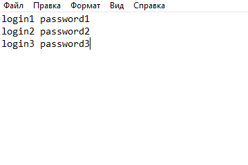

# бот для решения тестов в системе moodle

## основной функционал
- в accs.txt содержится списков аккаунтов в мудл системе, в которых нужно сделать тесты
- в папке data формируется json, в котором записываются вопросы и ответы в тесте, в picts сохраняются все нужные картинки, которые были укзаны в json, пример такого json'а есть в корне проекта
- в качестве браузера для селениум использован [geckodriver](https://github.com/mozilla/geckodriver/releases), показался удобнее chromedriver'а

настройка ультра сложная, я не писал гибкий код, чтобы бот работал на всех разновидностях тестов, работает только в формате 1 вопрос в 1 странице.

## для того чтобы использовать бота на другом тесте его нужно
1) переписать код под нужный тест
2) заполнить json в соответствии с вопросами и ответами для этого теста, также при необходимости заполнить папку picts
3) сформировать список аккичей и записать их в accs.txt, записываются через строку, в одной строке логин и пароль разделены 1 пробелом.

4) запустить bot.py