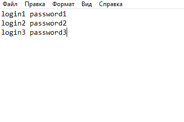

# Бот для решения тестов в системе moodle

## Основной функционал
- в assets/accs1.txt содержится списков аккаунтов в мудл системе, для которых нужно сделать тесты
- в папке assets/data формируется json, в котором записываются вопросы и ответы в тесте, в assets/pictures сохраняются все нужные картинки, которые были укзаны в json
- в качестве браузера для selenium использован [geckodriver](https://github.com/mozilla/geckodriver/releases)

## Для того чтобы использовать бота на другом тесте, нужно
1) запустить json_maker.py для теста
2) скорее всего придется переписать код в src/application/resolvers
2) заполнить json в соответствии с вопросами и ответами для этого теста, также при необходимости заполнить папку assets/pictures
3) сформировать список аккичей и записать их в assets/accs.txt, записываются через строку, в одной строке логин и пароль разделены 1 пробелом.

4) запустить main.py